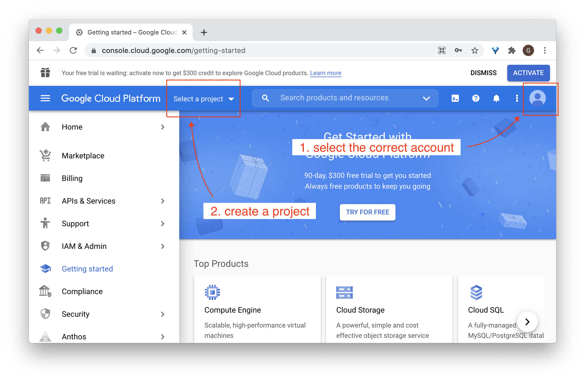
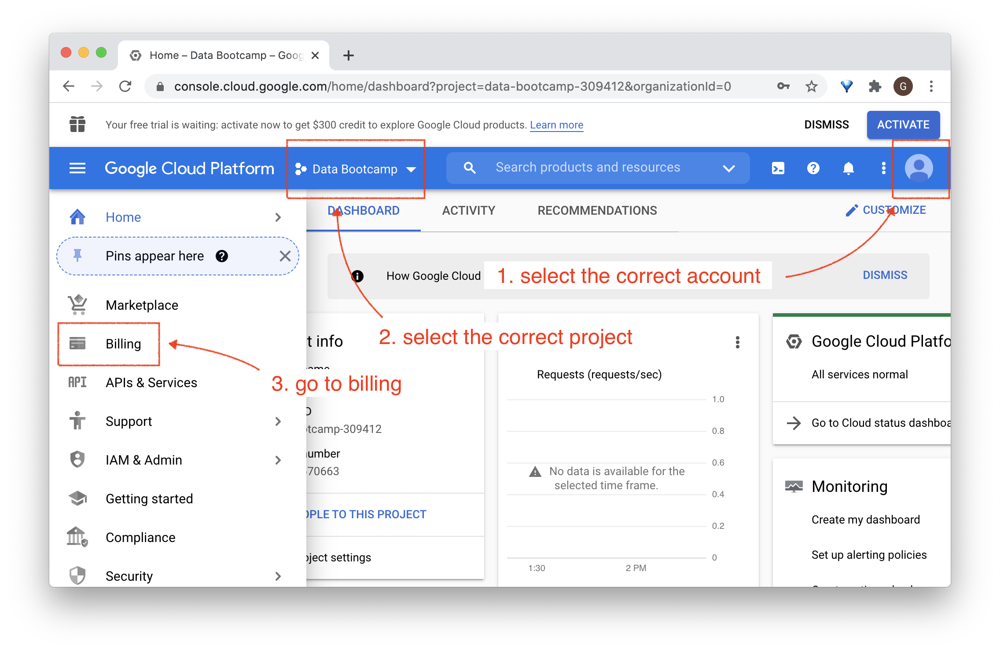
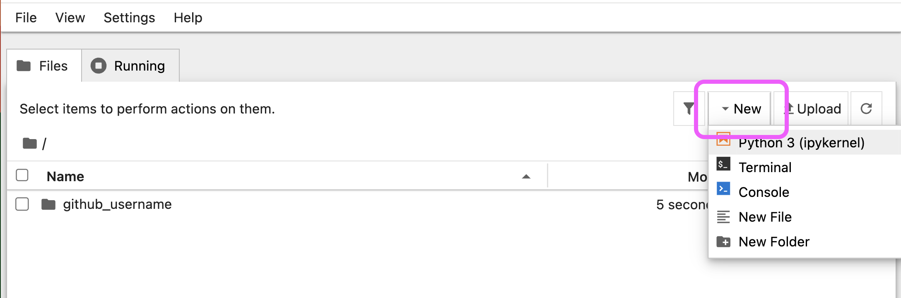
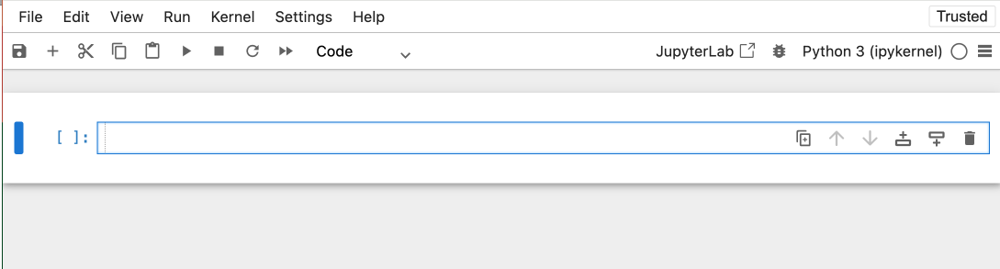

# Setup instructions

You will find below the instructions to set up you computer for [Le Wagon Data Analytics course](https://www.lewagon.com/data-analytics-course/full-time)

Please **read them carefully and execute all commands in the following order**. If you get stuck, don't hesitate to ask a teacher for help :raising_hand:

Let's start :rocket:


## GitHub account

Have you signed up to GitHub? If not, [do it right away](https://github.com/join).

:point_right: **[Upload a picture](https://github.com/settings/profile)** and put your name correctly on your GitHub account. This is important as we'll use an internal dashboard with your avatar. Please do this **now**, before you continue with this guide.


:point_right: **[Enable Two-Factor Authentication (2FA)](https://docs.github.com/en/authentication/securing-your-account-with-two-factor-authentication-2fa/configuring-two-factor-authentication#configuring-two-factor-authentication-using-text-messages)**. GitHub will send you text messages with a code when you try to log in. This is important for security and also will soon be required in order to contribute code on GitHub.


## Google Cloud Platform setup

[GCP](https://cloud.google.com/) is a cloud solution that you are going to use in order to deploy your Machine Learning-based products to production.

🚨 If you are a student of the **Part-Time Bootcamp**, SKIP THIS SECTION FOR NOW! **GCP** offers $300 worth of free credits for a duration of 3 months. You do not want to activate your GCP account too soon 🙅‍♂️

### Project setup

- Go to [Google Cloud](https://console.cloud.google.com/) and create an account if you do not already have one
- In the Cloud Console, on the project list, select or create a Cloud project

⚠️ **Important:** When creating a new project, you will see an **Organization** field. Leave this set to **"No organization"**. Do not select or create an organization. Choosing an organization applies restrictions that can prevent you from using GCP services during the bootcamp.



- Give it a name such as `Wagon Bootcamp` for example
- Notice the `ID` automatically created for the project, e.g. `wagon-bootcamp-123456`


ℹ️ Note the **Project ID** (e.g. `wagon-bootcamp-123456`) this is **not** the same as the project name you chose (e.g. `Wagon Bootcamp`). You will need the ID later when running terminal commands, but don't worry, you can always find it in GCP.

### Account language

In order to facilitate the following of the instructions during the bootcamp, open your GCP account preferences:

[https://myaccount.google.com/language](https://myaccount.google.com/language)

If the *preferred language* is not:

- **English**
- **United States**

Then switch the language to english:

- Click on the edit pen logo
- Select **English**
- Select **United States**
- Click on **Select**

### Billing account

You will now link your account to your credit card. This step is required or you will not be able to use the services provided by GCP. Do not worry, you will be able to consume most GCP services through free credits throughout the bootcamp.

⚠️ In some cases, Google may charge your card (around €10) to verify that it is valid. This will unfortunately not be refunded once you are approved, but will be added as credit in GCP that you can use once your free credits have been used or expired.



- Click on **Billing**
- Click on **MANAGE BILLING ACCOUNTS**
- Click on **ADD BILLING ACCOUNT**
- Give a name to your billing account, e.g. `My Billing Account`
- Click on "I have read..." and agree the to the terms of service
- Click on **CONTINUE**
- Select your account type: `Individual`
- Fill your name and address

You should see that you have a free credit of "$300 credits over the next 90days".

- Click on card details
- Enter your credit card info
- Click on **START MY FREE TRIAL**

Once this is done, verify that your billing account is linked to your GCP project.

- Select your project
- Go to **Billing**
- Select **LINK A BILLING ACCOUNT**
- Select `My Billing Account`
- Click on **SET ACCOUNT**

You should now see:

```bash
Free trial status: $300 credit and 91 days remaining - with a full account, you'll get unlimited access to all of Google Cloud Platform.
```

<details>
  <summary>👉 If you do not own a credit card 👈</summary>

If you do not own a credit card, an alternative is to setup a **Revolut** account.
Revolut is a financial app that will allow you to create a virtual credit card linked to your mobile phone billing account.

Skip this step if you own a credit card and use your credit card for the setup.

Download the Revolut app, or go to [revolut](https://www.revolut.com/a-radically-better-account) and follow the steps to download the app (enter your mobile phone number and click on Get Started).

- Open the Revolut app
- Enter your mobile phone number
- Enter the verification code received by SMS
- The app will ask for your country, address, first and last name, date of birth, email address
- The app will also ask for a selfie and request your profession
- The app will require a photo of your identification card or passport

Once this is done, select the standard (free) plan. No need to add the card to Apple pay, or ask for a the delivery of a physical card, or add money securely.

You now have a virtual card which we will use for the GCP setup.

In the main view of the Revolut app

- Click on Ready to use
- Click on the card
- Click on Show card details
- Note down the references of the virtual credit card and use them in order to proceed with the GCP setup

</details>

<details>
  <summary>👉 If you receive an email from Google saying "Urgent: your billing account XXXXXX-XXXXXX-XXXXXX has been suspended" 👈</summary>

This may happen especially in case you just setup a Revolut account.

- Click on PROCEED TO VERIFICATION
- You will be asked to send a picture of your credit card (only the last 4 digits, no other info)
- In case you used **Revolut**, you can send a screenshot of your virtual credit card (do not forget to remove the validity date from the screenshot)
- Explain that you are attending the Le Wagon bootcamp, do not own a credit card, and have just created a Revolut account in order to setup GCP for the bootcamp using a virtual credit card

You may receive a validation or requests for more information within 30 minutes.

Once the verification goes through, you should receive an email stating that "Your Google Cloud Platform billing account XXXXXX-XXXXXX-XXXXXX has been fully reinstated and is ready to use.".

</details>

### Enabling GCP services

- Make sure that billing is enabled for your Google Cloud project

ℹ️ You have a **$300 credit** to use for Google Cloud resources, which will be more than enough for the bootcamp.

- [Enable the BigQuery and Compute Engine APIs](https://console.cloud.google.com/flows/enableapi?apiid=bigquery,compute) (This step may take a few minutes)

That's it for the browser setup! Terminal setup comes later in this guide.


## Visual Studio Code

### Installation

Let's install [Visual Studio Code](https://code.visualstudio.com) text editor.

Copy (`Ctrl` + `C`) the commands below then paste them in your terminal (`Ctrl` + `Shift` + `v`):

```bash
wget -qO- https://packages.microsoft.com/keys/microsoft.asc | gpg --dearmor > packages.microsoft.gpg
```

```bash
sudo install -o root -g root -m 644 packages.microsoft.gpg /etc/apt/trusted.gpg.d/
```

```bash
sudo sh -c 'echo "deb [arch=amd64,arm64,armhf signed-by=/etc/apt/trusted.gpg.d/packages.microsoft.gpg] https://packages.microsoft.com/repos/code stable main" > /etc/apt/sources.list.d/vscode.list'
```

```bash
rm -f packages.microsoft.gpg
```

```bash
sudo apt update
```

```bash
sudo apt install -y code
```

These commands will ask for your password: type it in.

:warning: When you type your password, nothing will show up on the screen, **that's normal**. This is a security feature to mask not only your password as a whole but also its length. Just type in your password and when you're done, press `Enter`.

### Launching from the terminal

Now let's launch VS Code from **the terminal**:

```bash
code
```

:heavy_check_mark: If a VS Code window has just opened, you're good to go :+1:

:x: Otherwise, please **contact a teacher**


## VS Code Extensions

### Installation

Let's install some useful extensions to VS Code.

```bash
code --install-extension ms-vscode.sublime-keybindings
code --install-extension emmanuelbeziat.vscode-great-icons
code --install-extension MS-vsliveshare.vsliveshare
code --install-extension ms-python.python
code --install-extension KevinRose.vsc-python-indent
code --install-extension ms-python.vscode-pylance
code --install-extension ms-toolsai.jupyter
code --install-extension alexcvzz.vscode-sqlite
```

Here is a list of the extensions you are installing:

- [Sublime Text Keymap and Settings Importer](https://marketplace.visualstudio.com/items?itemName=ms-vscode.sublime-keybindings)
- [VSCode Great Icons](https://marketplace.visualstudio.com/items?itemName=emmanuelbeziat.vscode-great-icons)
- [Live Share](https://marketplace.visualstudio.com/items?itemName=MS-vsliveshare.vsliveshare)
- [Python](https://marketplace.visualstudio.com/items?itemName=ms-python.python)
- [Python Indent](https://marketplace.visualstudio.com/items?itemName=KevinRose.vsc-python-indent)
- [Pylance](https://marketplace.visualstudio.com/items?itemName=ms-python.vscode-pylance)
- [Jupyter](https://marketplace.visualstudio.com/items?itemName=ms-toolsai.jupyter)
- [SQLite](https://marketplace.visualstudio.com/items?itemName=alexcvzz.vscode-sqlite)


## Command line tools

### Check the locale

The locale is a mechanism allowing to customize programs to your language and country.

Let's verify that the default locale is set to English, please type this in the Ubuntu terminal:

```bash
locale
```

If the output does not contain `LANG=en_US.UTF-8`, run the following command in a Ubuntu terminal to install the english locale:

```bash
sudo locale-gen en_US.UTF-8
```

If after, you receive a warning (`bash: warning: setlocale: LC_ALL: cannot change locale (en_US.utf-8)`) in your terminal, please do the following:

<details>
  <summary>Generate locale</summary>

Please, run this lines in your terminal.

```bash
sudo update-locale LANG=en_US.UTF8
sudo apt-get update
sudo apt-get install language-pack-en language-pack-en-base manpages
```
</details>

### Zsh & Git

Instead of using the default `bash` [shell](https://en.wikipedia.org/wiki/Shell_(computing)), we will use `zsh`.

We will also use [`git`](https://git-scm.com/), a command line software used for version control.

Let's install them, along with other useful tools:
- Open an **Ubuntu terminal**
- Copy and paste the following commands:

```bash
sudo apt update
```

```bash
sudo apt install -y curl git imagemagick jq unzip vim zsh tree
```

These commands will ask for your password: type it in.

:warning: When you type your password, nothing will show up on the screen, **that's normal**. This is a security feature to mask not only your password as a whole but also its length. Just type in your password and when you're done, press `Enter`.

### GitHub CLI installation

Let's now install [GitHub official CLI](https://cli.github.com) (Command Line Interface). It's a software used to interact with your GitHub account via the command line.

In your terminal, copy-paste the following commands and type in your password if asked:

```bash
sudo apt remove -y gitsome # gh command can conflict with gitsome if already installed
curl -fsSL https://cli.github.com/packages/githubcli-archive-keyring.gpg | sudo dd of=/usr/share/keyrings/githubcli-archive-keyring.gpg
```

```bash
echo "deb [arch=$(dpkg --print-architecture) signed-by=/usr/share/keyrings/githubcli-archive-keyring.gpg] https://cli.github.com/packages stable main" | sudo tee /etc/apt/sources.list.d/github-cli.list > /dev/null
```

```bash
sudo apt update
```

```bash
sudo apt install -y gh
```

To check that `gh` has been successfully installed on your machine, you can run:

```bash
gh --version
```

:heavy_check_mark: If you see `gh version X.Y.Z (YYYY-MM-DD)`, you're good to go :+1:

:x: Otherwise, please **contact a teacher**


## Oh-my-zsh

Let's install the `zsh` plugin [Oh My Zsh](https://ohmyz.sh/).

In a terminal execute the following command:

```bash
sh -c "$(curl -fsSL https://raw.github.com/ohmyzsh/ohmyzsh/master/tools/install.sh)"
```

If asked "Do you want to change your default shell to zsh?", press `Y`

At the end your terminal should look like this:


:heavy_check_mark: If it does, you can continue :+1:

:x: Otherwise, please **ask for a teacher**


## direnv

[direnv](https://direnv.net/) is a shell extension. It makes it easy to deal with per project environment variables. This will be useful in order to customize the behavior of your code.


``` bash
sudo apt-get update; sudo apt-get install direnv
echo 'eval "$(direnv hook zsh)"' >> ~/.zshrc
```


## GitHub CLI

CLI is the acronym of [Command-line Interface](https://en.wikipedia.org/wiki/Command-line_interface).

In this section, we will use [GitHub CLI](https://cli.github.com/) to interact with GitHub directly from the terminal.

It should already be installed on your computer from the previous commands.

We will use the GitHub CLI (`gh`) to connect to GitHub using *SSH*, a protocol to log in using SSH keys instead of the well known username/password pair.

First in order to **login**, copy-paste the following command in your terminal:

:warning: **DO NOT edit the `email`** — Even though `user:email` looks like a placeholder for your actual email address, it isn't — do not replace it.

```bash
gh auth login -s 'user:email' -w --git-protocol ssh
```

`gh` will ask you few questions:

- `Generate a new SSH key to add to your GitHub account?` Press `Enter` to ask gh to generate the SSH keys for you.

  If you already have SSH keys, you will see instead `Upload your SSH public key to your GitHub account?` With the arrows, select your public key file path and press `Enter`.

- `Enter a passphrase for your new SSH key (Optional)`:
  - **FOR MOST PEOPLE:** Just press `Enter` to skip. You don't need a passphrase for the bootcamp and it would prompt you every time you use the key. There is a risk, however, that if someone steals your laptop, they could then push to GitHub.
  - **IF SECURITY IS REALLY IMPORTANT TO YOU:** Enter a passphrase of your choice and press `Enter`. It's _really_ important that if you enter a passphrase, you write it down somewhere immediately and do not lose/forget it. You will need to enter this frequently.

- `Title for your SSH key`. You can leave it at the proposed "GitHub CLI", press `Enter`.

You will then get the following output:

```bash
! First copy your one-time code: 0EF9-D015
- Press Enter to open github.com in your browser...
```

Select and copy the code (`0EF9-D015` in the example), then press `Enter`.

Your browser will open and ask you to authorize GitHub CLI to use your GitHub account. Accept and wait a bit.

Come back to the terminal, press `Enter` again, and that's it.

To check that you are properly connected, type:

```bash
gh auth status
```

:heavy_check_mark: If you get `Logged in to github.com as <YOUR USERNAME> `, then all good :+1:

:x: If not, **contact a teacher**.


## Google Cloud CLI

Install the `gcloud` CLI to communicate with [Google Cloud Platform](https://cloud.google.com/) through your terminal:

```bash
echo "deb [signed-by=/usr/share/keyrings/cloud.google.gpg] https://packages.cloud.google.com/apt cloud-sdk main" | sudo tee -a /etc/apt/sources.list.d/google-cloud-sdk.list
sudo apt-get install apt-transport-https ca-certificates gnupg
curl https://packages.cloud.google.com/apt/doc/apt-key.gpg | sudo apt-key --keyring /usr/share/keyrings/cloud.google.gpg add -
sudo apt-get update && sudo apt-get install google-cloud-sdk
sudo apt-get install google-cloud-sdk-app-engine-python
```

👉 [Install documentation](https://cloud.google.com/sdk/docs/install#deb)


## Dotfiles

Hackers love to refine and polish their shell and tools. We'll start with a great default configuration provided by [Le Wagon](http://github.com/lewagon/dotfiles), stored on GitHub.

### Check your GitHub CLI configuration

First, let's do a quick check. Open your terminal and run the following command:

```bash
export GITHUB_USERNAME=`gh api user | jq -r '.login'`
echo $GITHUB_USERNAME
```

You should see your GitHub username printed. If it's not the case, **stop here** and ask for help.
There seems to be a problem with the previous step (`gh auth`).

### Fork and/or clone dotfiles

There are three options, choose **one**:


<details>
    <summary>
        <strong>I did not attend the Web Dev or Data Science & AI or Data Analytics bootcamp at Le Wagon</strong>
    </summary>

 As your configuration is personal, you need your own repository storing it, so you'll need to fork it to your GitHub account.

Forking means that it will create a new repo in your GitHub account, identical to the original one. You'll have a new repository on your GitHub account, `your_github_username/dotfiles`. We need to fork because each of you will need to put specific information (e.g. your name) in those
files.

Lets' run this command to fork the repo, and clone it on your laptop:

```bash
mkdir -p ~/code/$GITHUB_USERNAME && cd $_
gh repo fork lewagon/dotfiles --clone
```

</details>


<details>
    <summary>
        <strong>I already attended a Le Wagon coding bootcamp (Web Development or Data Science & AI or Data Analytics) <em>but I have a new laptop</em></strong>
    </summary>

This means that you already forked the GitHub repo `lewagon/dotfiles`, but at that time the configuration was maybe not ready for the current Data Analytics bootcamp. Let's update it. **Ask a TA to join you for the nex steps.**

First, clone your fork on this machine:

```bash
mkdir -p ~/code/$GITHUB_USERNAME && cd $_
gh repo clone $GITHUB_USERNAME/dotfiles
```


Open your terminal and go to your `dotfiles` project:

```bash
cd ~/code/$GITHUB_USERNAME/dotfiles
```

Time to merge the changes from `lewagon/dotfiles` into yours:

1. Commit your current version of your dotfiles:

   ```bash
   git add .
   git status # Check what will be committed
   git commit -m "Version prior to new setup"
   ```

1. Let's bring in the changes from upstream: `git merge upstream/master`

1. Check that you're not in `MERGING` state. If you are, resolve any conflicts.

1. Do a `git diff HEAD~1 HEAD` to check what changed.

1. If nothing seems out of the ordinary, continue

<details>
  <summary>Too many conflicts?
  </summary>

  Let's just take over the current version from `lewagon/dotfiles`.

  First abort the merge: `git merge --abort`.

  Run `code .`

  In VS Code, open the `zshrc` file. Replace its content with the [newest version](https://raw.githubusercontent.com/lewagon/dotfiles/master/zshrc). Save to disk.

  Still in VS Code, open the `zprofile` file. Replace its content with the [newest version](https://raw.githubusercontent.com/lewagon/dotfiles/master/zprofile). Save to disk.

  Back in the terminal, run a `git diff` and check if this didn't remove any personal configuration setting that you wanted to keep.

</details>

Time to commit your changes and push them.

```bash
git add .
git commit -m "Update for Data Analytics bootcamp"
git push origin master
```

</details>


<details>
    <summary>
        <strong>I already did the setup of a Le Wagon coding bootcamp (WebDev or Data Science & AI or Data Analytics) <em>on the same laptop</em> before</strong>
    </summary>

This means that you already forked and cloned the GitHub repo `lewagon/dotfiles`, but at that time the configuration was maybe not ready for the current Data Analytics bootcamp. Let's update it. **Ask a TA to join you for the nex steps.**


Open your terminal and go to your `dotfiles` project:

```bash
cd ~/code/$GITHUB_USERNAME/dotfiles
```

Time to merge the changes from `lewagon/dotfiles` into yours:

1. Commit your current version of your dotfiles:

   ```bash
   git add .
   git status # Check what will be committed
   git commit -m "Version prior to new setup"
   ```

1. Let's bring in the changes from upstream: `git merge upstream/master`

1. Check that you're not in `MERGING` state. If you are, resolve any conflicts.

1. Do a `git diff HEAD~1 HEAD` to check what changed.

1. If nothing seems out of the ordinary, continue

<details>
  <summary>Too many conflicts?
  </summary>

  Let's just take over the current version from `lewagon/dotfiles`.

  First abort the merge: `git merge --abort`.

  Run `code .`

  In VS Code, open the `zshrc` file. Replace its content with the [newest version](https://raw.githubusercontent.com/lewagon/dotfiles/master/zshrc). Save to disk.

  Still in VS Code, open the `zprofile` file. Replace its content with the [newest version](https://raw.githubusercontent.com/lewagon/dotfiles/master/zprofile). Save to disk.

  Back in the terminal, run a `git diff` and check if this didn't remove any personal configuration setting that you wanted to keep.

</details>

Time to commit your changes and push them.

```bash
git add .
git commit -m "Update for Data Analytics bootcamp"
git push origin master
```

</details>


### Run the dotfiles installer

It's time to run the `dotfiles` installer:

```bash
cd ~/code/$GITHUB_USERNAME/dotfiles && zsh install.sh
```

Check the emails registered with your GitHub Account. You'll need to pick one at the next step:

```bash
gh api user/emails | jq -r '.[].email'
```

Run the git installer:

```bash
cd ~/code/$GITHUB_USERNAME/dotfiles && zsh git_setup.sh
```

:point_up: This will **prompt** you for your name (`FirstName LastName`) and your email.
:warning: You **need** to put one of the emails listed above thanks to the previous `gh api ...` command. If you don't do that, Kitt won't be able to track your progress. 💡 Select the `@users.noreply.github.com` address if you don't want your email to appear in public repositories you may contribute to.

Please now **quit** all your opened terminal windows.


## Disable SSH passphrase prompt

You don't want to be asked for your passphrase every time you communicate with a distant repository. So, you need to add the plugin `ssh-agent` to `oh my zsh`:

First, open the `.zshrc` file:

```bash
code ~/.zshrc
```

Then:
- Spot the line starting with `plugins=`
- Add `ssh-agent` at the end of the plugins list

:heavy_check_mark: Save the `.zshrc` file with `Ctrl` + `S` and close your text editor.


## Installing Python (with [`pyenv`](https://github.com/pyenv/pyenv))

### Uninstall `conda`

As we are using `pyenv` to install and manage our Python version, we need to uninstall [`conda`](https://docs.conda.io/projects/conda/en/latest/), another package manager you may have on your machine if you previously installed [Anaconda](https://www.anaconda.com/). Thus, we are preventing any possible Python version issue later.

Check if you have `conda` installed on your machine:

```bash
conda list
```


If you have `zsh: command not found: conda`, you can **skip** the uninstall of `conda` and jump to the **Install `pyenv`** section.


<details>
    <summary markdown='span'><code>conda</code> uninstall instructions</summary>

- Install the Anaconda-Clean package from your terminal and run the cleaning

```bash
conda install anaconda-clean
anaconda-clean --yes
```

- Remove every Anaconda directories

```bash
rm -rf ~/anaconda2
rm -rf ~/anaconda3
rm -rf ~/.anaconda_backup

```

- Remove Anaconda path from your `.bash_profile`
  - Open the file with `code ~/.bash_profile`
  - If the file opens find the line matching the following pattern `export PATH="/path/to/anaconda3/bin:$PATH"` and delete the line

  - Save the file with `CTRL` + `s`

- Restart your terminal with `exec zsh`
- Remove Anaconda initialization from your `.zshrc`:
  - Open the file with `code ~/.zshrc`
  - Remove the code lines starting from `>>> conda initialize >>>` to `<<< conda initialize <<<`

</details>


### Install `pyenv`

Ubuntu comes with an outdated version of Python that we don't want to use. You might already have installed Anaconda or something else to tinker with Python and Data Analytics packages. All of this does not really matter as we are going to do a professional setup of Python where you'll be able to switch which version you want to use whenever you type `python` in the terminal.

First let's install `pyenv` with the following Terminal command:

```bash
git clone https://github.com/pyenv/pyenv.git ~/.pyenv
exec zsh
```

Let's install some [dependencies](https://github.com/pyenv/pyenv/wiki/common-build-problems#prerequisites) needed to build Python from `pyenv`:

```bash
sudo apt-get update; sudo apt-get install make build-essential libssl-dev zlib1g-dev \
libbz2-dev libreadline-dev sqlite3 libsqlite3-dev wget curl llvm \
libncursesw5-dev xz-utils tk-dev libxml2-dev libxmlsec1-dev libffi-dev liblzma-dev \
python3-dev
```

### Install Python

Let's install the [latest stable version of Python](https://www.python.org/doc/versions/) supported by Le Wagon's curriculum:

```bash
pyenv install 3.12.9
```

This command might take a while, this is perfectly normal. Don't hesitate to help other students seated next to you!

<details>
  <summary>🛠 Troubleshooting `pyenv` not found</summary>

If you encounter an error `Command 'pyenv' not found`: execute the following line:

```bash
source ~/.zprofile
```

Then try to install Python again:

```bash
pyenv install 3.12.9
```

If `pyenv` is still not found, contact a teacher.

</details>
<br>

OK once this command is complete, we are going to tell the system to use this version of Python **by default**. This is done with:

```bash
pyenv global 3.12.9
exec zsh
```

To check if this worked, run `python --version`. If you see `3.12.9`, perfect! If not, ask a TA that will help you debug the problem thanks to `pyenv versions` and `type -a python` (`python` should be using the `.pyenv/shims` version first).


## Python Virtual Environment

Before we start installing relevant Python packages, we will isolate the setup for the Bootcamp into a **dedicated** virtual environment. We will use a `pyenv` plugin called [`pyenv-virtualenv`](https://github.com/pyenv/pyenv-virtualenv).

### Setup a virtualenv

First let's install this plugin:

```bash
git clone https://github.com/pyenv/pyenv-virtualenv.git $(pyenv root)/plugins/pyenv-virtualenv
exec zsh
```

Let's create the virtual environment we are going to use during the whole bootcamp:

```bash
pyenv virtualenv 3.12.9 lewagon
```

Let's now set the virtual environment with:

```bash
pyenv global lewagon
```

Great! Anytime we'll install Python package, we'll do it in that environment.


### Python packages

Now that we have a pristine `lewagon` virtual environment, it's time to install some packages in it.

First, let's upgrade `pip`, the tool to install Python Packages from [pypi.org](https://pypi.org). In the latest terminal where the virtualenv `lewagon` is activated, run:

```bash
pip install --upgrade pip
```

Then let's install some packages for the first weeks of the program:


``` bash
pip install -r https://raw.githubusercontent.com/lewagon/data-analytics-setup/master/specs/releases/linux.txt
```


## Jupyter Notebook tweaking

Let's improve the display of the [`details` disclosure elements](https://developer.mozilla.org/en-US/docs/Web/HTML/Element/details) in your notebooks.

Run the following lines to create a `custom.css` stylesheet in your Jupyter config directory:

```bash
LOCATION=$(jupyter --config-dir)/custom
SOURCE=https://raw.githubusercontent.com/lewagon/data-analytics-setup/refs/heads/master/specs/jupyter/custom.css
mkdir -p $LOCATION
curl $SOURCE > $LOCATION/custom.css
```


## Python setup check

### Python and packages check

Let's reset your terminal:

```bash
cd ~/code && exec zsh
```

Check your Python version with the following commands:

```bash
zsh -c "$(curl -fsSL https://raw.githubusercontent.com/lewagon/data-analytics-setup/master/checks/python_checker.sh)" 3.12.9
```

Run the following command to check if you successfully installed the required packages:

```bash
zsh -c "$(curl -fsSL https://raw.githubusercontent.com/lewagon/data-analytics-setup/master/checks/pip_check.sh)"
```

Now run the following command to check if you can load these packages:

```bash
python -c "$(curl -fsSL https://raw.githubusercontent.com/lewagon/data-analytics-setup/master/checks/pip_check.py)"
```

### Jupyter check

Make sure you can run Jupyter:

```bash
jupyter notebook
```

Your web browser should open on a `jupyter` window:


Click on `New` and in the dropdown menu select `Python 3 (ipykernel)`:



A tab should open on a new notebook:



Make sure that you are running the correct python version in the notebook. Open a cell and run:

``` python
import sys; sys.version
```

It should output `3.12.9` followed by some more details. If not, check with a TA.

You can close your web browser then terminate the jupyter server with `CTRL` + `C`.

Here you have it! A complete python virtual env with all the third-party packages you'll need for the whole bootcamp.


## Insomnia

> ℹ️ **Why?** Insomnia is one of the best-known API testing tools, and it will be useful in our Introduction to API course.

- Go to [https://insomnia.rest/download](https://insomnia.rest/download)

- Download Insomnia

- Install Insomnia


### Configure Cloud sdk

- Authenticate the `gcloud` CLI with the google account you used for GCP


```bash
gcloud auth login
```


- Login to your Google account on the new tab opened in your web browser
- List your active account and check your email address you used for GCP is present

```bash
gcloud auth list
```

- Set your current project (replace `PROJECT_ID` with the `ID` of your project, e.g. `wagon-bootcamp-123456`)

```bash
gcloud config set project PROJECT_ID
```

- List your active account and current project and check your project is present

```bash
gcloud config list
```


Now let's set up Application Default Credentials so your Python code can access GCP:

```bash
gcloud auth application-default login
```

This will open a browser window. Log in with the same Google account you used to create your GCP project. Your credentials will be saved automatically.


Let's verify your Application Default Credentials are working:

```bash
gcloud auth application-default print-access-token
```

You should see a long token string. If you see an error, run `gcloud auth application-default login` again.

<details>
  <summary>Troubleshooting</summary>

- `AccessDeniedException: 403 The project to be billed is associated with an absent billing account.`
  - Make sure that billing is enabled for your Google Cloud Platform project [https://cloud.google.com/billing/docs/how-to/modify-project](https://cloud.google.com/billing/docs/how-to/modify-project)
</details>

🏁 You are done with the GCP setup!


  ## Kitt

You should have received an email from Le Wagon inviting you to sign up on [Kitt](https://kitt.lewagon.com) (our learning platform).

Then you should receive an additional invitation from Slack, inviting you to the Le Wagon Alumni slack community (where you'll chat with your buddies and all the previous alumni). Click on **Join** and complete the information.

If you haven't, please contact your teaching team.


## Slack

[Slack](https://slack.com/) is a communication platform pretty popular in the tech industry.

### Installation

[Download the Slack app](https://get.slack.help/hc/en-us/articles/212924728-Slack-for-Linux-beta-) and install it.

:warning: If you are already using Slack in your browser, please download and install **the desktop app** which is fully featured.


### Settings

Launch the app and sign in to `lewagon-alumni` organization.

Make sure you **upload a profile picture** :point_down:


The idea is that you'll have Slack open all day, so that you can share useful links / ask for help / decide where to go to lunch / etc.

To ensure that everything is working fine for video calls, let's test your camera and microphone:
- Open the Slack app
- Click your profile picture in the top right.
- Select `Preferences` from the menu.
- Click `Audio & video` in the left-side column.
- Below `Troubleshooting`, click `Run an audio, video and screensharing test`. The test will open in a new window.
- Check that your preferred speaker, microphone and camera devices appear in the drop-down menus, then click `Start test`.


:heavy_check_mark: When the test is finished, you should see green "Succeed" messages at least for your microphone and camera. :+1:

:x: If not, **contact a teacher**.

You can also install Slack app on your phone and sign in `lewagon-alumni`!


## Bonus

If you are done with your setup, please ask around if some classmates need some help with theirs (macOS, Linux, Windows). We will have our first lectures at 2pm and will talk about the Setup you just did + onboard you on Kitt.

If you don't have a lot of experience with `git` and GitHub, please [(re-)watch this workshop](https://www.youtube.com/watch?v=Z9fIBT2NBGY) (`1.25` playback speed is fine).


